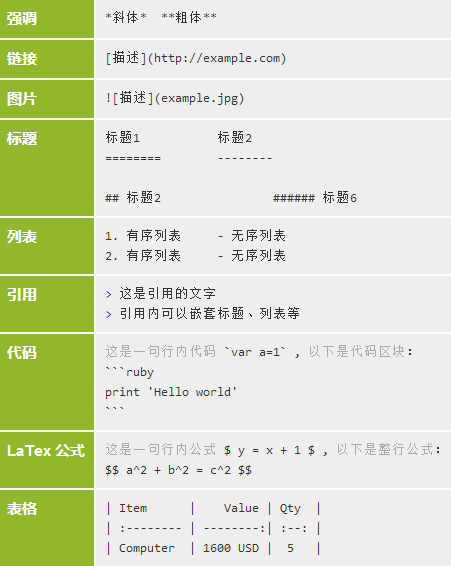

Data Scientist Toolbox 第二周 Summary
===

[@生物你好生物再见](http://www.weibo.com/biobyelogy)

### 命令行

| 命令      | 用途         |
|:----------|:-------------|
| pwd       | 显示当前路径 |
| clear     | 清屏         |
| ls        | 列出目录内容 |
| cd        | 改变当前路径 |
| mkdir     | 创建文件夹   |
| touch     | 创建空文件   |
| cp        | 文件复制     |
| rm        | 文件删除     |
| mv        | 改名或移动   |
| date      | 显示如期     |
| echo      | 显示值       |

===

### Git
略，推荐一个浅显易懂的 Git 教程：
- [网页版](http://www.liaoxuefeng.com/wiki/0013739516305929606dd18361248578c67b8067c8c017b000)
- [PDF 版](https://github.com/numbbbbb/Git-Tutorial-By-liaoxuefeng/tree/master)

===

### R Package
| 命令                             | 作用                          |
|:----                             |:----                          |
| available.packages()             | 查看 CRAN 上的 R package 列表 |
| install.packages(<package_name>) | 安装                          |
| library(<package_name>)          | 载入                          |

===

### Markdown
图片来自[马克飞象](http://maxiang.info/)帮助

